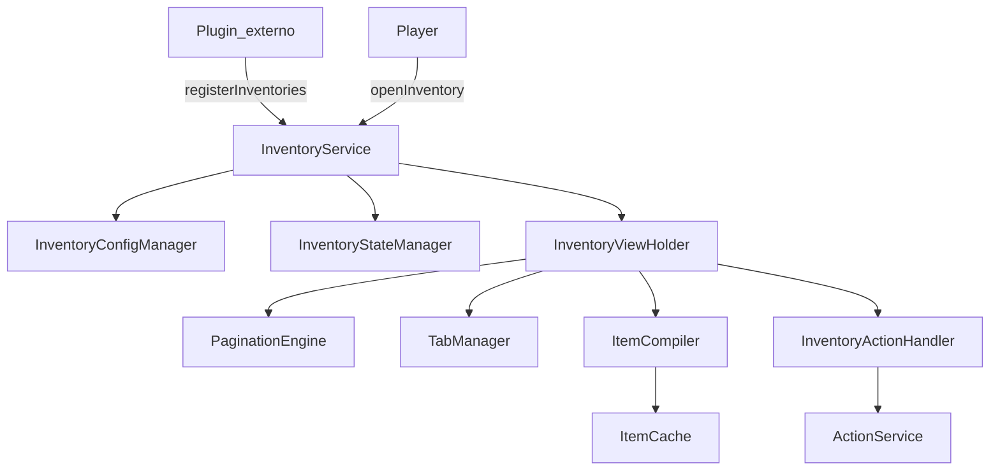
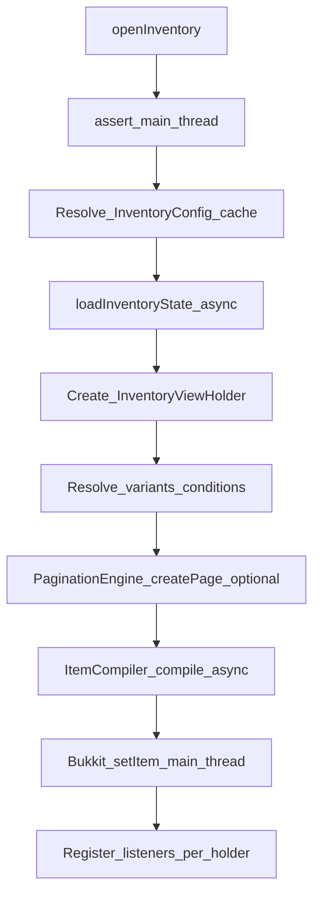

## `InventoryService` (AfterCore 1.5.6)

`InventoryService` é a **API pública** do framework de GUI (inventários) do AfterCore para **Spigot 1.8.8**.
Ele orquestra o carregamento do YAML (`inventories.yml`), renderização/compilação de itens, handlers de click,
paginação, tabs, animações, drag-and-drop, inventários compartilhados e persistência de estado.

### Navegação rápida

- [API e schema YAML](Inventory-Framework-API.md)
- [Exemplos funcionais (Java + YAML)](Inventory-Framework-Examples.md)

### O que o serviço faz (escopo real)

- **Abertura e navegação**: `openInventory`, `openSharedInventory`, `closeInventory`
- **Registro de inventários YAML**: `registerInventories(...)` (inclui inventários de plugins externos)
- **Persistência de estado (async)**: `saveInventoryState` / `loadInventoryState`
- **Cache e invalidação**: `clearCache`, `clearCache(inventoryId)`, `invalidateItemCache`, `clearPlayerCache` (novo em 1.5.6)
- **Extensão por código**: `registerTypeHandler(type, handler)` para handlers por `item.type`
- **Templates**: `templates()` (`ItemTemplateService`)

### Arquitetura (alto nível)

O `InventoryService` é a “fachada” pública. Por baixo, o fluxo principal passa por `InventoryConfigManager`,
`InventoryViewHolder`, `ItemCompiler`, `PaginationEngine`, `TabManager` e `InventoryActionHandler`.



### Fluxo real de abertura (`openInventory`)

`openInventory(...)` **exige main thread**, carrega estado do DB de forma **assíncrona** e só então abre/renderiza
na main thread.



### Uso básico (registrar YAML e abrir)

```java
import com.afterlands.core.api.AfterCore;
import com.afterlands.core.inventory.InventoryContext;
import com.afterlands.core.inventory.InventoryService;
import org.bukkit.entity.Player;
import org.bukkit.plugin.java.JavaPlugin;

import java.io.File;

public final class MyPlugin extends JavaPlugin {

    @Override
    public void onEnable() {
        saveResource("inventories.yml", false);

        InventoryService inventory = AfterCore.get().inventory();
        File inventoriesFile = new File(getDataFolder(), "inventories.yml");

        int loaded = inventory.registerInventories(this, inventoriesFile);
        getLogger().info("Inventários registrados: " + loaded);
    }

    public void openMainMenu(Player player) {
        InventoryContext ctx = new InventoryContext(player.getUniqueId(), "main-menu")
                .withPlaceholder("player", player.getName())
                .withPluginNamespace(getName().toLowerCase()); // opcional (i18n)

        AfterCore.get().inventory().openInventory(this, player, "main-menu", ctx);
    }
}
```

### API pública atual (resumo)

| Método | Retorno | Thread | Observação |
|---|---|---|---|
| `openInventory(Player, String, InventoryContext)` | `void` | Main | Abre por ID (já namespaced se você registrou com namespace) |
| `openInventory(Plugin, Player, String, InventoryContext)` | `void` | Main | Abre inventário do plugin (namespace do plugin) |
| `openSharedInventory(List<Player>, String, InventoryContext)` | `String` | Main | **Requer** `shared: true` no YAML |
| `closeInventory(Player)` | `void` | Main | Fecha e tenta salvar se persistência/autosave estiverem habilitados |
| `saveInventoryState(UUID, String, InventoryState)` | `CompletableFuture<Void>` | Async | Salva estado no DB |
| `loadInventoryState(UUID, String)` | `CompletableFuture<InventoryState>` | Async | Carrega estado do DB (ou inicial) |
| `reloadConfigurations()` | `CompletableFuture<Void>` | Async | Recarrega YAML (não afeta inventários já abertos) |
| `clearCache()` | `void` | Thread-safe | Limpa cache global de config + itens |
| `clearCache(String)` | `void` | Thread-safe | Invalida config + itens de um inventário |
| `invalidateItemCache(String)` | `void` | Thread-safe | Invalida **só** itens compilados (mantém config cacheada) |
| `clearPlayerCache(UUID)` | `void` | Thread-safe | Invalida cache associado a **um jogador** (ex.: idioma/perfil mudou) |
| `templates()` | `ItemTemplateService` | Thread-safe | Templates de item (recomendado para listas dinâmicas) |
| `isInventoryRegistered(String)` | `boolean` | Thread-safe | Verifica registro |
| `registerInventory(InventoryConfig)` | `void` | Thread-safe | Registro programático |
| `registerInventories(File)` | `int` | Sync | Carrega YAML externo (sem namespace automático) |
| `registerInventories(Plugin, File)` | `int` | Sync | Carrega YAML externo **com namespace do plugin** |
| `registerTypeHandler(String, ClickHandler)` | `void` | Thread-safe | Handler por `item.type` (injeção por código) |

### `InventoryContext` (placeholders, data e i18n)

O `InventoryContext` carrega dados “por abertura” e é consumido pelo pipeline de compilação/renderização.

- **Placeholders do contexto**: `{key}` via `withPlaceholder("key", "value")`
- **PlaceholderAPI (opcional)**: `%...%` (quando instalado; execução na main thread quando envolve player)
- **Dados arbitrários**: `withData("key", value)` + `getData("key", Class<T>)`
- **Namespace do plugin (opcional)**: `withPluginNamespace("aftertemplate")` para ajudar na resolução de i18n (nome/lore/título) quando houver integração com MessageService.

Chaves reais já usadas pelo framework em `context.data`:

- **`contentItems`** (`List<GuiItem>`): fonte de conteúdo para paginação. Observação: os itens dessa lista **não precisam** ter `slot`; o engine distribui nos slots `O` do layout.
- **`programmaticItems`** (`List<GuiItem>`): override de slots por código (slot do `GuiItem` é respeitado).
- **`navigation_history`** (`List<NavigationEntry>`): histórico interno usado por `previous_panel`/`back` (navegação).

### Quando usar o quê (guia prático)

- **`registerInventories(this, file)`**: padrão recomendado para plugins consumidores do AfterCore; evita colisão de IDs (namespacing).
- **`openInventory(this, player, "id", ctx)`**: recomendado para abrir um inventário do seu plugin com o namespace correto e suportar `open_panel` preservando o escopo do plugin.
- **`openInventory(player, "plugin:id", ctx)`**: útil quando você já tem o ID namespaced completo.
- **`openSharedInventory(...)`**: use quando múltiplos players devem ver o **mesmo** estado (ex.: trade/auction). Garanta `shared: true` no YAML.
- **`invalidateItemCache(inventoryId)`**: quando só a renderização mudou (placeholders/layout/itens) e você não quer recarregar configs.
- **`clearPlayerCache(playerId)`**: quando algo **do player** muda (idioma, perfil, placeholders dependentes do jogador), sem afetar o cache global.

### Regras de thread (obrigatórias)

- Chame `openInventory`, `openSharedInventory` e `closeInventory` **na main thread**.
- Operações de estado (`save` / `load`) e `reloadConfigurations` já são **async** (não bloqueie a main thread).
- PlaceholderAPI e Bukkit API são **main thread only**; o framework cuida disso internamente, mas plugins não devem forçar `.join()`/`.get()` em futures na main thread.

### Integrações opcionais

- **PlaceholderAPI**: habilita placeholders `%...%` no pipeline.
- **ProtocolLib**: habilita atualização de título sem reabrir janela (`TitleUpdateSupport`).

### Veja também

- [API e schema YAML](Inventory-Framework-API.md)
- [Exemplos funcionais](Inventory-Framework-Examples.md)
